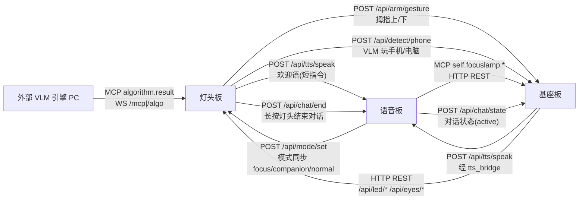
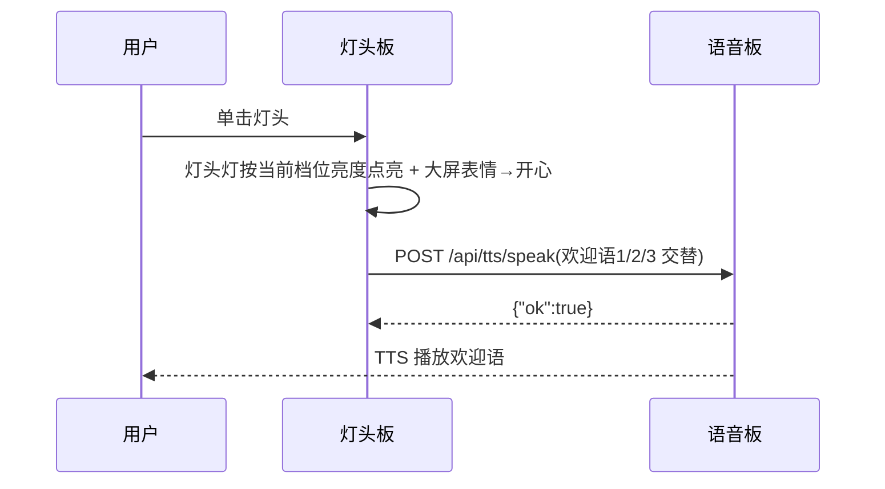
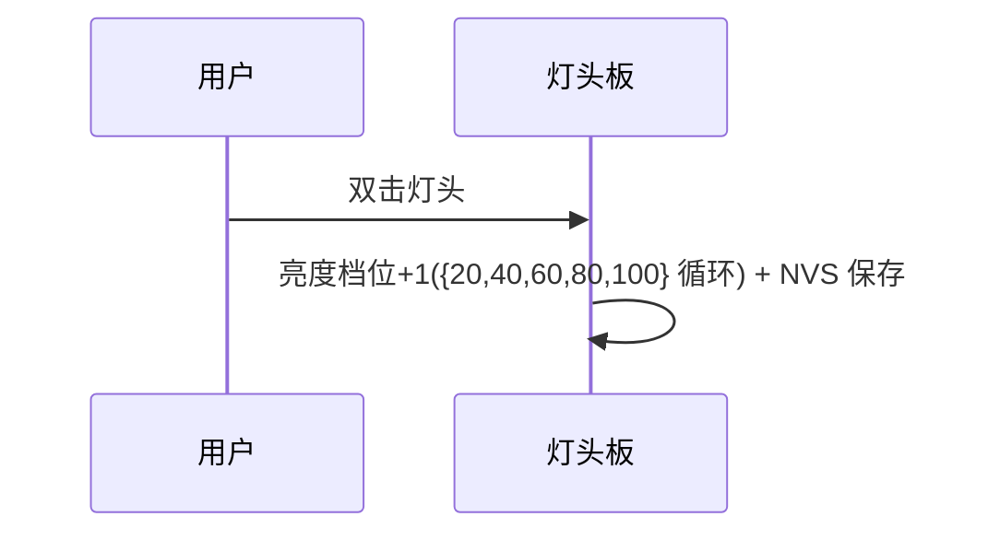
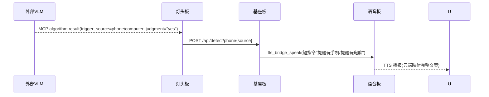
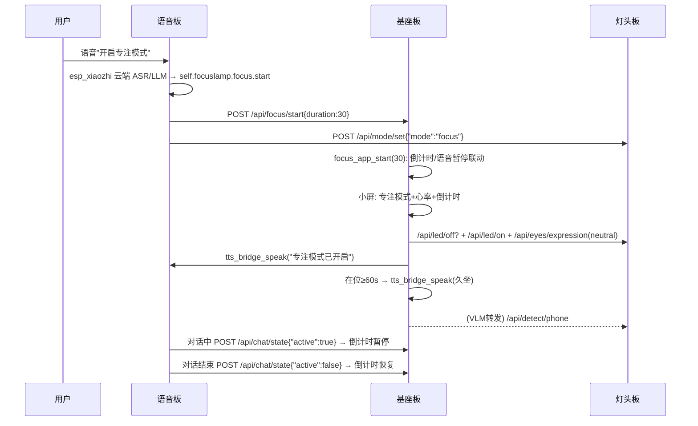
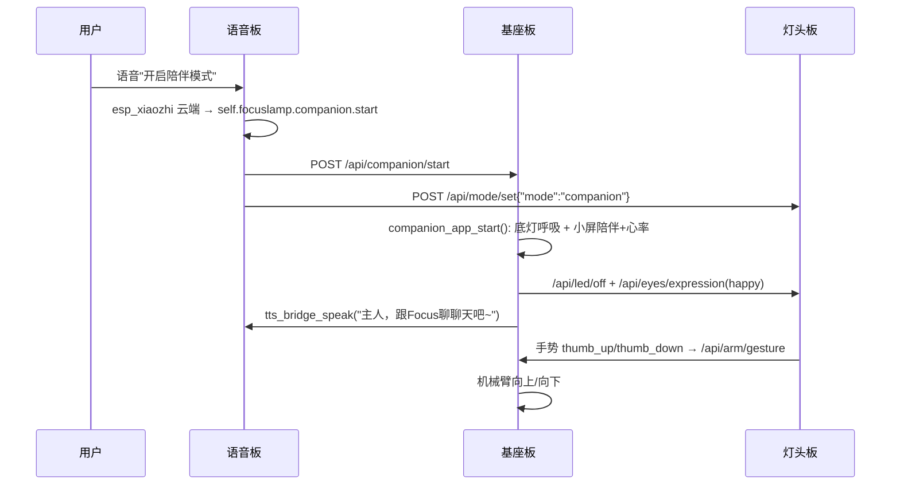
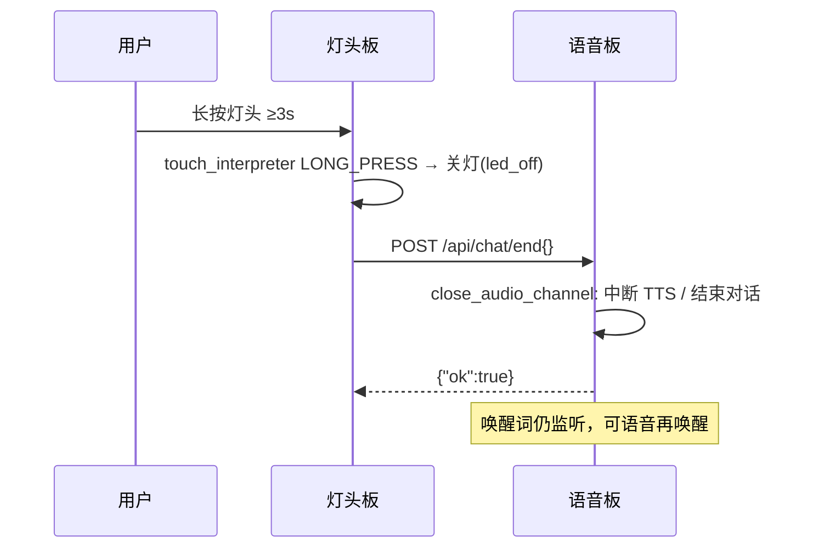

# 09-三板联动 Demo 接口契约

## 目标

定义 FocusLamp 演示场景中"灯头板 / 基座板 / 语音板"三块板之间的全部交互接口（REST / WebSocket / MCP / 配置项），作为三工程分板开发的唯一基线。开发必须严格遵循本契约，任何接口变更需先修订本文档并经用户确认。

**任务范围**：

- 做：定义板间 REST 端点、MCP 工具、数据字段、配置项、需求场景时序
- 不做：实现代码（本文档仅契约）；不修改 sdkconfig(.defaults) 与 managed_components

**当前状态**：v1 待用户确认。三工程已完成 git 初始化（tts-broadcast `fb1e962`、camera-fps `4d4e4f8`、dowm 基线）。

---

## 1. 参与方与角色

| 板卡 | 工程（绝对路径） | 角色 | 已具备能力 |
|---|---|---|---|
| 灯头板 | `c:\Projects\Part-time-job\Focus_demo2\FocusLamp_DEMO2-feature-camera-fps-optimization` | 摄像头/大屏/灯头灯/灯头触摸 | MIPI DSI 大屏表情、灯头灯(暖/冷双通道)、OV5647 推流、TTP223 单击/双击/长按、MCP algorithm.result 接收 VLM 结果、WebSocket 服务器、`POST /api/mode/set`(语音板模式同步) |
| 基座板 | `c:\Projects\Part-time-job\Focus_demo2\FocusLamp_DEMO2-dowm` | 小屏/底灯/机械臂/雷达心率 | 小屏 LCD 信息页、底部呼吸灯、机械臂动作库、雷达 HRV 心率、REST API、`tts_bridge`、focus_app/companion_app、`POST /api/chat/state`(语音对话状态) |
| 语音板 | `c:\Projects\Part-time-job\Focus_demo2\FocusLamp_DEMO2-feature-tts-broadcast` | 语音对话/TTS 播报 | esp_xiaozhi 对话、唤醒词、`POST /api/tts/speak`、focuslamp_bridge(HTTP→基座板)、mipi_dsi_bridge(HTTP→灯头板)、异步 TTS 注入队列 |

## 2. 系统交互总览

## 3. 板间地址配置（menuconfig，禁止直接改 sdkconfig）

各板通过 menuconfig 配置对端 IP，由用户在 `idf.py menuconfig` 中设置并保存。

| 板卡 | 配置项 | 默认值 | 说明 |
|---|---|---|---|
| 灯头板 | `CONFIG_TTS_INJECT_TARGET_IP` | `192.168.1.110` | 语音板 IP（欢迎语注入） |
| 灯头板 | `CONFIG_BASE_BRIDGE_TARGET_IP` | `192.168.1.120` | 基座板 IP（手势/检测转发） |
| 基座板 | `CONFIG_TTS_BRIDGE_TARGET_IP` | `192.168.1.110` | 语音板 IP（已有，tts_bridge） |
| 基座板 | `CONFIG_STATUS_REPORTER_TARGET_IP` | `192.168.1.100` | 灯头板 IP（已有，灯头控制） |
| 语音板 | `CONFIG_FOCUSLAMP_BRIDGE_TARGET_IP` | `192.168.1.120` | 基座板 IP（已有） |
| 语音板 | `CONFIG_MIPI_DSI_BRIDGE_TARGET_IP` | `192.168.1.100` | 灯头板 IP（已有） |

## 4. 接口清单

### 4.1 新增 REST 端点（基座板，注册于 `s_rest_uris[]`）

| 端点 | 方法 | 请求体 | 响应 | 实现 | 调用方 |
|---|---|---|---|---|---|
| `POST /api/arm/gesture` | POST | `{"gesture":"thumb_up"\|"thumb_down"}` | `{"ok":true}` | 机械臂单步动作（arm_service）：thumb_up→servo0=1850、thumb_down→servo0=1150，500ms；先 stop 当前动作再执行 | 灯头板 |
| `POST /api/detect/phone` | POST | `{"source":"phone"\|"computer"}` | `{"ok":true}` | 映射短指令"提醒玩手机"/"提醒玩电脑" → `tts_bridge_speak` 播报 | 灯头板 |
| `POST /api/companion/start` | POST | `{"duration":0}` | `{"ok":true}` | `companion_app_start()` | 语音板 |
| `POST /api/companion/stop` | POST | `{}` | `{"ok":true}` | `companion_app_stop()`（未运行视为成功） | 语音板 |
| `POST /api/chat/state` | POST | `{"active":true\|false}` | `{"ok":true}` | `device_state_set_voice_active()`，focus_app 据此暂停/恢复倒计时 | 语音板 |

### 4.2 新增 MCP 工具（语音板 focuslamp_bridge）

| 工具名 | 参数 | 映射 REST |
|---|---|---|
| `self.focuslamp.focus.start` | `duration`(分钟,默认30) | `POST {FOCUSLAMP_BRIDGE_TARGET_IP}/api/focus/start` + `POST {MIPI_DSI_BRIDGE_TARGET_IP}/api/mode/set` `{"mode":"focus"}` |
| `self.focuslamp.focus.stop` | 无 | `POST /api/focus/stop` + `POST /api/mode/set` `{"mode":"normal"}` |
| `self.focuslamp.companion.start` | 无 | `POST {FOCUSLAMP_BRIDGE_TARGET_IP}/api/companion/start` + `POST {MIPI_DSI_BRIDGE_TARGET_IP}/api/mode/set` `{"mode":"companion"}` |
| `self.focuslamp.companion.stop` | 无 | `POST {FOCUSLAMP_BRIDGE_TARGET_IP}/api/companion/stop` + `POST {MIPI_DSI_BRIDGE_TARGET_IP}/api/mode/set` `{"mode":"normal"}` |

> 说明：focus/companion start/stop 时，语音板并行向灯头板 `POST /api/mode/set` 同步模式（`algo_result_set_mode` 切换算法结果处理：FOCUS 启用 VLM/在位检测、COMPANION 启用手势）。

### 4.3 新增能力（灯头板，无对外新端点）

| 能力 | 触发 | 动作 | 依赖新模块 |
|---|---|---|---|
| 欢迎语 TTS 注入 | `touch_handler` TAP | 交替选择 3 条短指令"欢迎语1/2/3" → `POST {TTS_INJECT_TARGET_IP}/api/tts/speak` `{"text":...,"priority":1}`（云端映射完整文案，用户手动同步） | `tts_inject` HTTP 客户端模块 |
| VLM 结果转发 | `mcp_cb_algo_result` | `vlm_judgment=="yes"`(英文枚举) 且 `vlm_trigger_source` 为 phone/computer → `POST /api/detect/phone`（节流 ≥60s） | `base_bridge` |
| 手势转发 | `mcp_cb_algo_result`（复用 VLM `gesture` 字段） | `gesture` 变化为 Thumb_Up/Thumb_Down → `POST /api/arm/gesture`（节流 ≥1s） | `base_bridge` |
| 模式同步接收 | 语音板 `POST /api/mode/set` | `focus`→`ALGO_MODE_FOCUS`、`companion`→`ALGO_MODE_COMPANION`、其余→`ALGO_MODE_NORMAL`，切换算法结果处理 | REST API |
| 长按灯头（≥3s） | `touch_handler` LONG_PRESS | 关闭灯头灯 + `POST {TTS_INJECT_TARGET_IP}/api/chat/end`（语音板结束对话，唤醒词仍可用） | `tts_inject_end_chat`（复用 `tts_inject` HTTP 客户端） |

### 4.4 小屏心率渲染（基座板 lcd_service）

- 数据源：`device_state.radar`（由 `EV_RADAR_HEART_RATE` / `EV_RADAR_HRV_READY` 写入）
- 渲染：
  - 专注模式（INFO 页）：进度条下方新增"心率XX"行（布局：模式名 Y0 / 任务+倒计时 Y18 / 进度条 Y36 高6 / 心率 Y44）
  - 陪伴模式（表情页）：顶部叠加"陪伴模式"、底部叠加"心率XX"（保留开心眼睛），由 `lcd_service_set_companion_overlay()` 开关控制
- 心率无效时显示"心率--"

### 4.5 新增 REST 端点（语音板，注册于 `ws_manager_server_register_uri`）

| 端点 | 方法 | 请求体 | 响应 | 实现 | 调用方 |
|---|---|---|---|---|---|
| `POST /api/tts/speak` | POST | `{"text":"短指令","priority":1}` | `{"ok":true}` | `xiaozhi_manager_speak`（异步 TTS 注入队列） | 灯头板/基座板 |
| `POST /api/chat/end` | POST | `{}`（忽略） | `{"ok":true}` | `xiaozhi_manager_close_audio_channel()`（关闭音频通道，中断进行中的 TTS 并结束对话；唤醒词仍可用） | 灯头板（长按） |

## 5. 数据字段与业务规则

### 5.1 玩手机/电脑播报（基座板唯一播报源）

TTS 播报只接受短指令触发，基座板将 source 映射为短指令经 `tts_bridge_speak` 注入语音板，云端（语音板配置）将短指令映射为完整文案，由用户手动同步。

| source | 基座板短指令 | 云端完整文案 |
|---|---|---|
| phone | 提醒玩手机 | 识别到您正在玩手机，快把手机放下，好好专注把工作完成吧 |
| computer | 提醒玩电脑 | 识别到您正在玩电脑游戏，快停下来活动一下，然后先专注把工作完成再玩吧~ |

### 5.2 欢迎语（灯头板 `s_welcome_messages[]`，3 条短指令交替）

交替选择："欢迎语1" → "欢迎语2" → "欢迎语3" → 循环。云端将短指令映射为完整欢迎文案，由用户手动同步。

### 5.3 灯头灯亮度（固定五档，无环境光）

| 档位索引 | 亮度 |
|---|---|
| 0 | 20% |
| 1 | 40% |
| 2 | 60%（默认） |
| 3 | 80% |
| 4 | 100% |

- **单击灯头亮灯**：按当前档位亮度点亮（`s_brightness_levels[current]`）
- **双击调档**：档位+1（`{20,40,60,80,100}`）循环切换，NVS 保存

### 5.4 专注模式在位久坐

- 触发条件：专注模式运行中 + 雷达在场 + 连续在位 ≥60s 且倒计时未暂停（语音对话中）
- 动作：`tts_bridge_speak("你已经坐了很久，请站起来活动活动吧~")`，每会话仅 1 次

### 5.5 VLM 转发节流

同一 `vlm_trigger_source` 两次转发间隔 ≥60s；source 变化时立即转发并重置计时。

## 6. 需求场景时序

### 6.1 场景1：单击灯头

### 6.2 场景2：双击灯头

### 6.3 场景3：外部 VLM 检测玩手机/电脑

### 6.4 场景5：语音开启专注模式

### 6.5 场景6：语音开启陪伴模式

### 6.6 场景7：长按灯头（≥3s）关灯并结束对话

## 7. 校验与验收

- 本契约全部端点字段与 §4/§5 一致后方可实现
- 实现顺序：基座板（B1-B5）→ 灯头板（A1-A4）→ 语音板（C1-C2）→ 联调
- 每板完成编译后由用户在本地执行 `idf.py build flash monitor` 实测，通过后才允许提交 git
- 最终按需求 1-6 逐条验收

## 全局约束

- 所有确认、提问必须通过交互工具进行
- 不修改 sdkconfig(.defaults) 与 managed_components，配置经 menuconfig 由用户保存
- Agent 不执行 idf.py build/flash/monitor，指导用户本地执行
- 文档示意图统一使用 Mermaid；文档内容与代码现状保持一致
