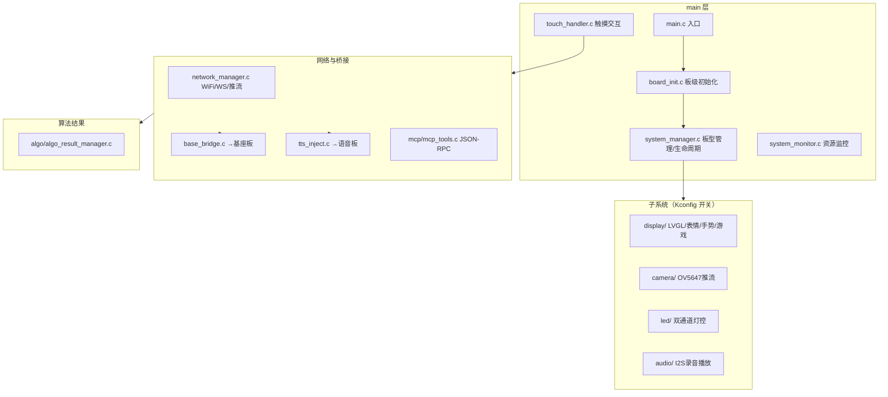

# FocusLamp_DEMO2-feature-camera-fps-optimization（灯头板）交接文档

> 文档日期：2026-08-25
> 用途：工程交接说明，供接手工程师快速了解"这个工程是干什么的、用什么做的、怎么跑起来"。
> 所属产品：FocusLamp 智能台灯 Demo（三块板：灯头板 / 基座板 / 语音板）
> 注意：本工程原为 MIPI DSI LCD + 摄像头帧率优化（camera-fps）分支，在三板联动中即「灯头板」固件。

---

## 1. 工程定位：这是干什么的

本工程是 **FocusLamp 智能台灯的「灯头板」固件**（摄像头 / 大屏 / 灯头灯 / 灯头触摸）。

在三板联动系统中承担的角色：

| 角色 | 具体职责 |
|------|---------|
| 大屏显示 | 3.4 寸 MIPI DSI 屏（480x480），LVGL GUI / 表情眼睛 / 触摸游戏 / 摄像头回显 |
| 灯头触摸 | TTP223 触摸：单击（亮灯+欢迎语）、双击（五档调光）、长按≥3s（关灯+结束对话） |
| 灯头灯 | 双通道 PWM 灯光（暖光/冷光），五档亮度 + 环境光自适应 |
| 摄像头 | OV5647（MIPI-CSI）采集 → JPEG 编码 → WebSocket 推流到浏览器 / MCP 控制 |
| 算法结果接收 | 通过 MCP `algorithm.result` 接收外部 VLM 引擎结果（表情/在位/玩手机/手势/疲劳） |
| 三板桥接 | `tts_inject`（→语音板播报）、`base_bridge`（→基座板机械臂/检测转发） |
| WebSocket 服务 | `/ws`、`/mcp`、`/camera` 三个通道，接收语音板模式同步、对外推流 |

**一句话总结**：灯头板 = 灯的「脸」——大屏表情、灯头灯光、触摸交互、摄像头视觉感知都在这里；通过 WebSocket/MCP/REST 与基座板、语音板联动。

---

## 2. 硬件平台：用什么干的

| 项目 | 规格 |
|------|------|
| 主控芯片 | **ESP32-P4** |
| 大屏 | KD034WXFID001 3.4 寸 **MIPI DSI** 480x480，驱动 IC **ST7701S**（DSI 2-lane，500Mbps/lane，60Hz） |
| 触摸屏 | **GT911** 电容触摸（I2C0：SDA=GPIO7 / SCL=GPIO8，地址 0x14，INT=GPIO36，RST=GPIO34） |
| 摄像头 | **OV5647**（MIPI-CSI 2-lane，RAW8 → ISP 转 RGB565，800x640@50fps，SCCB 地址 0x36） |
| 灯头灯 | 双通道 PWM：LED_A 暖光 GPIO29、LED_B 冷光 GPIO28（LEDC 5kHz，10bit） |
| 灯头触摸 | **TTP223** 数字触摸 GPIO21（单击/双击/长按） |
| 音频（BOTTOM 板） | I2S0 全双工：INMP441 麦克风 + MAX98357A 功放（BCLK=32 / WS=33 / DOUT=31 / DIN=30） |
| 存储 | LittleFS 分区（`storage`），存音频文件 |
| 屏幕背光 | GPIO0 背光使能 |
| 外设加速 | PPA（图像缩放）、JPEG 硬件编码器 |

### 2.1 板型（互斥，Kconfig 选择）

| 板型 | Kconfig | 子系统 | 用途 |
|------|---------|--------|------|
| **TOP 板**（默认） | `EXAMPLE_BOARD_TYPE_TOP` | 显示 + LED + 摄像头 + 触摸 | 灯头（本产品实际使用） |
| BOTTOM 板 | `EXAMPLE_BOARD_TYPE_BOTTOM` | 音频（I2S 麦克风/喇叭） | 音频演示/测试板 |

> TOP 与 BOTTOM 互斥，避免 I2S / MIPI DSI / 内存资源冲突；由 `system_manager` 统一生命周期管理。

---

## 3. 软件架构：怎么组织的



### 3.1 目录结构

```
FocusLamp_DEMO2-feature-camera-fps-optimization/
├── CMakeLists.txt / sdkconfig / sdkconfig.defaults
├── README.md / CONTRIBUTING.md
├── KD034WXFID001 MIPI.txt        # 屏初始化序列参考
├── st7701s_full_text.txt / lcd_full_text.txt
├── plan/                         # 分板开发计划与接口契约
│   └── 09-三板联动Demo接口契约.md   # ★三板联动唯一接口基线
├── tools/web_ui/index.html       # 摄像头/控制网页 UI
├── main/
│   ├── main.c / board_init.c / board_config.h
│   ├── system_manager.c / system_monitor.c / touch_handler.c
│   ├── algo/algo_result_manager.c   # 算法结果解析（MCP algorithm.result）
│   ├── mcp/mcp_tools.c              # MCP JSON-RPC 工具
│   ├── network/                     # network_manager / base_bridge / tts_inject
│   ├── display/                     # lvgl/expressive_eyes/gesture/touch_game 等
│   ├── camera/                      # camera_controller / camera_stream / preview / test
│   ├── audio/                       # audio_system / i2s_driver / recorder / player
│   └── led/                         # led_controller / led_test
└── components/
    ├── wifi_manager / websocket_manager
    ├── connection_manager / heartbeat_service / message_queue / task_manager
    ├── touch_sensor / touch_interpreter   # TTP223 与手势解析
    └── （managed_components 内含 esp_lvgl_port、expressive_eyes、esp_cam_sensor 等）
```

### 3.2 启动流程（`main.c`）

```
LED 初始化（先于阻塞的显示启动）
→ system_manager_init()：读 Kconfig，按板型初始化子系统
  - TOP：display（LVGL/表情）+ camera + LED
  - BOTTOM：audio
→ （可选）LED 测试 / 摄像头测试
→ system_manager_start()：启动子系统
→ touch_handler_init()：注册触摸交互
→ network_manager_init()：连 WiFi（最多 30s）→ 启动 WS 服务器
→ 注册 REST API（touch）+ 启动摄像头推流
→ 主循环：每秒心跳
```

### 3.3 触摸交互（`touch_handler.c`）

| 手势 | 动作 |
|------|------|
| 单击 TAP | 灯头灯按当前档位点亮 + 大屏表情→开心 + 交替注入 3 条欢迎语 TTS |
| 双击 DOUBLE_TAP | 亮度档位 +1（{5,11,18,24,30} 循环）+ NVS 保存 |
| 长按 ≥3s LONG_PRESS | 关灯 + `POST /api/chat/end` 结束语音对话（唤醒词仍可用） |

---

## 4. 对外接口：怎么和其他板通信

### 4.1 WebSocket 服务器（灯头板为服务端）

| 通道 | 用途 |
|------|------|
| `ws://IP/camera` | 摄像头 JPEG 帧推流（浏览器 tools/web_ui/index.html 可看） |
| `ws://IP/mcp` | MCP JSON-RPC（外部 VLM 引擎发 `algorithm.result`） |
| `ws://IP/algo` | 算法结果通道（VLM 结果备选入口） |

### 4.2 REST 端点（接收，esp_http_server）

| 端点 | 说明 | 调用方 |
|------|------|--------|
| `POST /api/mode/set` | 模式同步：focus / companion / normal → `algo_result_set_mode` | 语音板 |
| `POST /api/camera/start|stop`、`/api/camera/quality`、`/api/camera/fps` | 摄像头控制 | 语音板 MCP |
| `POST /api/display/on|off`、`/api/display/brightness`、`/api/display/camera_preview` | 显示控制 | 语音板 MCP / 基座板 |
| `POST /api/led/on|off`、`/api/led/brightness`、`/api/led/color_temp` | 灯头灯控制 | 语音板 MCP / 基座板 |
| `POST /api/eyes/expression`、`/look_at`、`/blink` | 表情眼睛控制 | 语音板 MCP / 基座板 |
| `GET /api/touch/wake`、`GET /api/touch/brightness`、`POST /api/touch/reset` | 触摸状态 | 语音板 MCP |

### 4.3 HTTP 出站（灯头板 → 其他板）

| 模块 | 目标 | 接口 |
|------|------|------|
| `tts_inject` | 语音板 | `POST /api/tts/speak` `{"text":"欢迎语1/2/3","priority":1}` |
| `tts_inject` | 语音板 | `POST /api/chat/end`（长按灯头结束对话） |
| `base_bridge` | 基座板 | `GET /api/ambient`（环境光 level 0-4） |
| `base_bridge` | 基座板 | `POST /api/arm/gesture` `{"gesture":"thumb_up"/"thumb_down"}` |
| `base_bridge` | 基座板 | `POST /api/detect/phone` `{"source":"phone"/"computer"}` |

### 4.4 关键 IP 配置（menuconfig，禁止直接改 sdkconfig）

| 配置项 | 默认值 | 含义 |
|--------|--------|------|
| `CONFIG_TTS_INJECT_TARGET_IP` | `192.168.1.110:80` | 语音板 IP（欢迎语注入 / 结束对话） |
| `CONFIG_BASE_BRIDGE_TARGET_IP` | `192.168.1.120:80` | 基座板 IP（环境光 / 手势 / 检测转发） |
| WiFi SSID/密码 | 由 `wifi_manager` 菜单配置 | 灯头板接入网络 |

---

## 5. 核心业务场景实现位置

| 场景 | 主要代码位置 |
|------|-------------|
| 欢迎语注入（单击） | `touch_handler.c` `s_welcome_messages[]` → `tts_inject_speak()` |
| 五档调光 | `touch_handler.c` `s_brightness_levels[]` + NVS |
| 环境光自适应 | 单击时 `base_bridge_get_ambient()` 查询基座板光感 level(0-4) → 映射亮度 |
| VLM 玩手机/电脑 | `algo_result_manager.c` 解析 `vlm.judgment` → `base_bridge_post_detect_phone()`（同源节流≥60s） |
| 手势→机械臂 | `algo_result_manager.c` 解析 `gesture` → `base_bridge_post_arm_gesture()`（节流≥1s） |
| 模式同步 | `POST /api/mode/set` → `ALGO_MODE_FOCUS/COMPANION/NORMAL` 切换算法处理 |
| 摄像头推流 | `camera/camera_stream.c`（OV5647 → JPEG 硬件编码 → WS） |
| 表情显示 | `display/expressive_eyes_display.cpp`（espp/expressive_eyes 组件） |

---

## 6. 构建与烧录（由用户本地执行）

```bash
cd E:\focus\Focus_demo2\FocusLamp_DEMO2-feature-camera-fps-optimization
idf.py set-target esp32p4
idf.py menuconfig   # 板型(TOP/BOTTOM)、子系统开关、对端 IP、WiFi 配置
idf.py build
idf.py flash monitor
```

> menuconfig 关键项：`Example Configuration` 下选择 `Board Type`、`Enable Display/LED/Camera/Touch`、`Demo to run`（LVGL / 表情 / 触摸游戏）、`TTS_INJECT_TARGET_IP`、`BASE_BRIDGE_TARGET_IP`。

---

## 7. 当前状态与待办（三板联动 Demo 视角）

| 优先级 | 事项 | 状态 |
|-------|------|------|
| 高 | VLM 算法端联调（玩手机/电脑、手势识别） | 协议已对齐，待算法端发 `algorithm.result` |
| 高 | 光感联动实测调参 | 环境光→亮度映射待实测 |
| 中 | 语音板云端文案同步 | 短指令→完整欢迎语/提醒文案需云端配置 |
| 中 | BOTTOM 板（音频）功能 | 独立子系统，灯头场景未启用 |
| 低 | 摄像头帧率 / 推流稳定性 | camera-fps 优化分支主题，持续调优 |

---

## 8. 交接注意事项

1. **本工程有两个板型**：产品实际使用 **TOP 板**（显示/LED/摄像头）；BOTTOM 板（音频）是同一代码库的另一个配置，两者互斥，通过 `menuconfig` 切换。
2. **大屏是 MIPI DSI**（不是 SPI）：初始化时序参考 `KD034WXFID001 MIPI.txt`；改时序参数在 `board_config.h` Section 1/2（HSA/HBP/HFP/VSA/VBP/VFP、DSI 速率）。
3. **触摸有两套**：大屏 GT911（I2C，手势/游戏）与灯头 TTP223（GPIO21，单击/双击/长按）用途不同，勿混淆。
4. **摄像头链路**：OV5647(MIPI-CSI) → ISP(RAW8→RGB565) → JPEG 硬件编码 → WebSocket 推流；依赖 `esp_cam_sensor`/`esp_video` 组件。
5. **算法结果入口**：外部 VLM 引擎通过 `ws://IP/mcp` 发送 `algorithm.result`（含 emotion/focus/presence/vlm_game_detector/gesture/fatigue 字段），由 `algo_result_manager` 解析分发。
6. **不直接修改 sdkconfig / managed_components**：配置一律通过 `idf.py menuconfig` 修改；组件依赖经 `idf.py add-dependency` 管理。
7. **编译注意**：`display/expressive_eyes_display.cpp` 为 C++ 源文件，`audio/player.cpp` 同理，修改时注意 C/C++ 混编规则。
