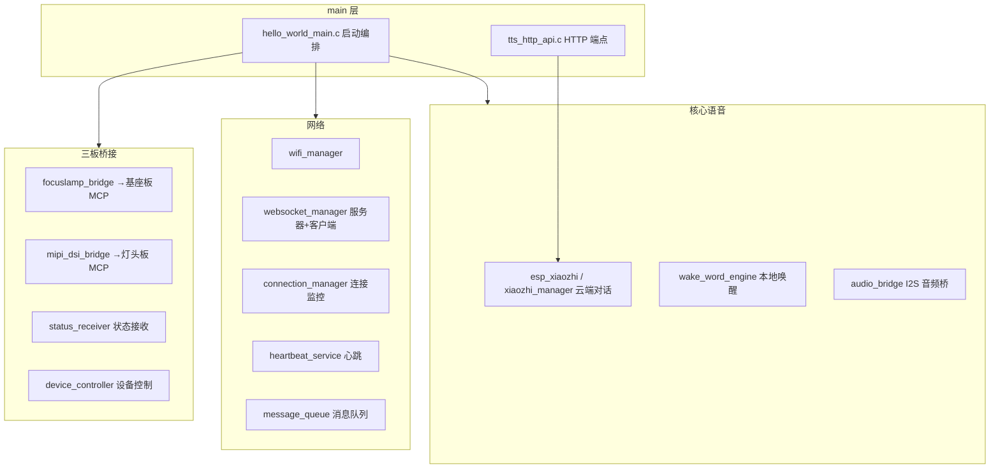

# FocusLamp_DEMO2-feature-tts-broadcast（语音板）交接文档

> 文档日期：2026-08-25
> 用途：工程交接说明，供接手工程师快速了解"这个工程是干什么的、用什么做的、怎么跑起来"。
> 所属产品：FocusLamp 智能台灯 Demo（三块板：灯头板 / 基座板 / 语音板）
> 注意：本工程是 tts-broadcast（TTS 语音播报）分支，在三板联动中即「语音板」固件。

---

## 1. 工程定位：这是干什么的

本工程是 **FocusLamp 智能台灯的「语音板」固件**（语音对话 / TTS 播报），是整套系统的"嘴巴"和"耳朵"。

在三板联动系统中承担的角色：

| 角色 | 具体职责 |
|------|---------|
| 语音对话 | 集成 **esp_xiaozhi**（晓之开放平台）：云端 ASR 语音识别 + LLM 大模型对话 + TTS 语音合成 |
| 本地唤醒 | **wake_word_engine**：本地唤醒词检测（你好小智 / 小智小智 / focus） |
| TTS 播报中心 | `POST /api/tts/speak` 接收灯头板/基座板注入的文本并播放（欢迎语、提醒等） |
| 对话结束 | `POST /api/chat/end` 关闭音频通道、结束对话（灯头板长按触发） |
| 基座板桥接 | `focuslamp_bridge`：MCP 工具 → 基座板 REST（专注/陪伴/灯光/机械臂等） |
| 灯头板桥接 | `mipi_dsi_bridge`：MCP 工具 → 灯头板 REST（摄像头/大屏/表情/灯） |
| 状态上报接收 | `status_receiver`：接收基座板 `POST /api/status/report` 状态快照 |
| 设备控制入口 | `device_controller`：统一设备控制（旧版，见注意事项） |
| 连接保障 | connection_manager / heartbeat_service / message_queue：WiFi+WS 健康监控、可靠消息投递 |

**一句话总结**：语音板 = 灯的「嘴和耳朵」——用户对它说话（云端 AI 理解），它对用户播报；同时也作为 TTS 播报中枢，为灯头板、基座板提供统一的语音输出通道。

---

## 2. 硬件平台：用什么干的

| 项目 | 规格 |
|------|------|
| 主控模块 | **WT01P4C5-S1**（ESP32-P4 + ESP32-C5 双芯片） |
| 主控芯片 | ESP32-P4（应用/语音处理） |
| WiFi 协处理器 | ESP32-C5（负责网络） |
| 麦克风 | 板载数字麦克风（I2S 输入，PCM 喂给唤醒词引擎与云端 ASR） |
| 扬声器 | 板载功放（I2S 输出，播放 TTS 合成音频） |
| 语音方案 | esp-sr（ESP-SR 唤醒词）、esp_xiaozhi（云端对话） |

---

## 3. 软件架构：怎么组织的



### 3.1 目录结构

```
FocusLamp_DEMO2-feature-tts-broadcast/
├── CMakeLists.txt               # project(wifi_test)
├── README.md / BACKLOG.md
├── ESP-NOW Protocol Analysis and MCP Tool Verification.md
├── main/
│   ├── hello_world_main.c       # ★主入口，全系统启动编排
│   ├── tts_http_api.c/h         # POST /api/tts/speak、POST /api/chat/end
│   └── CMakeLists.txt / idf_component.yml
└── components/
    ├── wifi_manager/            # WiFi 管理（STA + 静态IP）
    ├── websocket_manager/       # WS 客户端 + 服务器（HTTP 端点注册）
    ├── xiaozhi_manager/         # esp_xiaozhi 对话管理（MCP、音频回调）
    ├── audio_bridge/            # I2S 音频桥（TTS 播放）
    ├── wake_word_engine/        # ESP-SR 唤醒词引擎
    ├── focuslamp_bridge/        # MCP → 基座板 REST 桥
    ├── mipi_dsi_bridge/         # MCP → 灯头板 REST 桥
    ├── status_receiver/         # 基座板状态上报接收（/api/status/report）
    ├── device_controller/       # 设备控制（旧版）
    ├── connection_manager/      # WiFi+WS 健康监控
    ├── heartbeat_service/       # 心跳服务
    ├── message_queue/           # WebSocket 可靠消息队列
    └── task_manager/            # 任务管理
```

### 3.2 启动流程（`hello_world_main.c`）

```
① WiFi Manager 初始化 → 等待 WiFi 连接
② WebSocket Manager 初始化（客户端 + 服务器）
   - 服务器启动后：status_receiver_init()（/api/status/report）
   - tts_http_api_init()（/api/tts/speak、/api/chat/end）
③ FocusLamp Bridge 初始化 → ping 基座板
④ chat_state 异步上报任务（对话开始/结束 → 基座板 /api/chat/state）
⑤ Connection Manager 启动（WiFi/WS 健康监控）
⑥ Heartbeat Service（WS 服务器端存活检测）+ Message Queue
⑦ Audio Bridge 初始化（I2S TTS 播放）
⑧ Xiaozhi Manager 初始化（注册事件/音频回调）
⑨ Wake Word Engine 初始化 → 注册唤醒词 → 启动监听
⑩ Xiaozhi Manager start（启动 mic_task 喂 PCM）
主循环：每 10s 打印堆/网络/对话状态
```

### 3.3 关键回调逻辑

| 回调 | 触发 | 动作 |
|------|------|------|
| `wake_word_detect_callback` | 本地检测到唤醒词 | `xiaozhi_manager_send_wake_word()` 发起对话 |
| `xiaozhi_event_callback` | 音频通道打开/关闭 | `chat_state_report(true/false)` → 基座板暂停/恢复专注倒计时 |
| `xiaozhi_audio_callback` | 云端 TTS 音频（OPUS） | `audio_bridge_tts_callback()` 解码 → I2S 播放 |

---

## 4. 对外接口：怎么和其他板通信

### 4.1 HTTP 端点（接收，注册于 WS 服务器的 HTTP server）

| 端点 | 方法 | 请求体 | 功能 | 调用方 |
|------|------|--------|------|--------|
| `POST /api/tts/speak` | POST | `{"text":"短指令","priority":1}` | 异步 TTS 播报 | 灯头板/基座板 |
| `POST /api/chat/end` | POST | `{}` | 结束对话（关音频通道、中断 TTS） | 灯头板（长按） |
| `POST /api/status/report` | POST | 状态 JSON | 接收基座板状态快照 | 基座板 status_reporter |

### 4.2 MCP 工具（语音板 → 基座板，focuslamp_bridge）

| 工具名 | 映射 REST |
|--------|-----------|
| `self.focuslamp.focus.start/stop` | `POST /api/focus/start|stop` + 灯头板 `/api/mode/set` |
| `self.focuslamp.companion.start/stop` | `POST /api/companion/start|stop` + 灯头板 `/api/mode/set` |
| `self.focuslamp.led.on/off/brightness/...` | 基座板 `/api/led/*` |
| `self.focuslamp.lcd.*` | 基座板 `/api/lcd/*` |
| `self.focuslamp.servo.*` | 基座板 `/api/servo/*` |
| `self.focuslamp.motion.wave/nod/shake/dance/greet/home` | 基座板机械臂动作 |

### 4.3 MCP 工具（语音板 → 灯头板，mipi_dsi_bridge）

| 工具名 | 映射 REST |
|--------|-----------|
| `self.mipi_dsi.camera.start/stop/set_quality/set_fps` | 灯头板 `/api/camera/*` |
| `self.mipi_dsi.display.on/off/set_brightness/show_camera` | 灯头板 `/api/display/*` |
| `self.mipi_dsi.led.on/off/set_brightness/set_color_temp` | 灯头板 `/api/led/*` |
| `self.mipi_dsi.eyes.set_expression/look_at/blink` | 灯头板 `/api/eyes/*` |
| `self.mipi_dsi.touch.wake/brightness/reset` | 灯头板 `/api/touch/*` |

### 4.4 关键 IP 配置（menuconfig，禁止直接改 sdkconfig）

| 配置项 | 默认值 | 含义 |
|--------|--------|------|
| `CONFIG_FOCUSLAMP_BRIDGE_TARGET_IP` | `192.168.1.120:80` | 基座板 IP |
| `CONFIG_MIPI_DSI_BRIDGE_TARGET_IP` | `192.168.1.100:80` | 灯头板 IP |
| `CONFIG_WIFI_MANAGER_SSID/PASSWORD` | 由 wifi_manager 配置 | 语音板 WiFi |

---

## 5. 核心业务场景实现位置

| 场景 | 主要代码位置 |
|------|-------------|
| 语音对话 / 唤醒 | `components/xiaozhi_manager`、`components/wake_word_engine` |
| TTS 播报（欢迎语/提醒） | `main/tts_http_api.c` → `xiaozhi_manager_speak()` |
| 专注/陪伴模式语音控制 | `focuslamp_bridge` MCP 工具 → 基座板 REST + 灯头板 mode/set |
| 对话状态联动（倒计时暂停） | `hello_world_main.c` `chat_state_report()` → 基座板 `/api/chat/state` |
| 灯头长按结束对话 | 灯头板 `POST /api/chat/end` → `xiaozhi_manager_close_audio_channel()` |
| 接收基座板状态 | `status_receiver`（LED/显示/LCD/舵机/雷达/环境光/系统） |

---

## 6. 构建与烧录（由用户本地执行）

```bash
cd E:\focus\Focus_demo2\FocusLamp_DEMO2-feature-tts-broadcast
idf.py set-target esp32p4
idf.py menuconfig   # WiFi、对端 IP、唤醒词模型等配置
idf.py build
idf.py flash monitor
```

> 依赖组件（managed_components）：esp-sr（唤醒词模型，需按芯片下载）、esp_xiaozhi 相关依赖。唤醒词模型分区需在 partitions 中预留（build/srmodels 目录可见）。

---

## 7. 当前状态与待办

| 优先级 | 事项 | 状态 |
|-------|------|------|
| 中 | 云端账号/服务配置 | esp_xiaozhi 依赖云端 ASR/LLM 账号与网络，本地无法离线验证 |
| 中 | TTS 文案云端同步 | 短指令（欢迎语/玩手机等）→ 完整文案需在云端配置 |
| 中 | 语音指令 → MCP 工具完整链路联调 | 需与基座板/灯头板实测 |
| 低 | Barge-in（语音打断） | 代码已预留，暂未启用，需调参后接线 |
| 低 | device_controller（旧版） | 已被 focuslamp_bridge / mipi_dsi_bridge 取代，注意区分 |

---

## 8. 交接注意事项

1. **本工程是"语音中枢"**：TTS 播报由本板统一输出，灯头板（欢迎语）和基座板（提醒）都通过 `POST /api/tts/speak` 注入；短指令到完整文案的映射在语音板云端（esp_xiaozhi 平台）配置，不在固件中。
2. **MCP 工具注册时机**：focuslamp_bridge / mipi_dsi_bridge 的 MCP 工具在 xiaozhi_manager 每次重连后重新注册（防止重连后工具丢失）。
3. **唤醒词模型按语言编译**：`CONFIG_SR_MN_CN_MULTINET7_QUANT`（中文）→ 你好小智/小智小智；`CONFIG_SR_MN_EN_MULTINET7_QUANT`（英文）→ focus；通过 menuconfig 切换。
4. **日志级别策略**：`ESP_XIAOZHI_CHAT` / `esp_mcp_mgr` / `ESP_XIAOZHI_MCP` 曾被临时调到 INFO 排查 MCP 握手问题；调回 WARN 可减少 TTS 卡顿。
5. **不直接修改 sdkconfig / managed_components**：配置一律通过 `idf.py menuconfig`；唤醒词模型等组件依赖经 `idf.py add-dependency` 管理。
6. **相关文档**：`ESP-NOW Protocol Analysis and MCP Tool Verification.md` 记录了 ESP-NOW 协议分析与 MCP 工具验证过程，涉及旧链路可参考。
