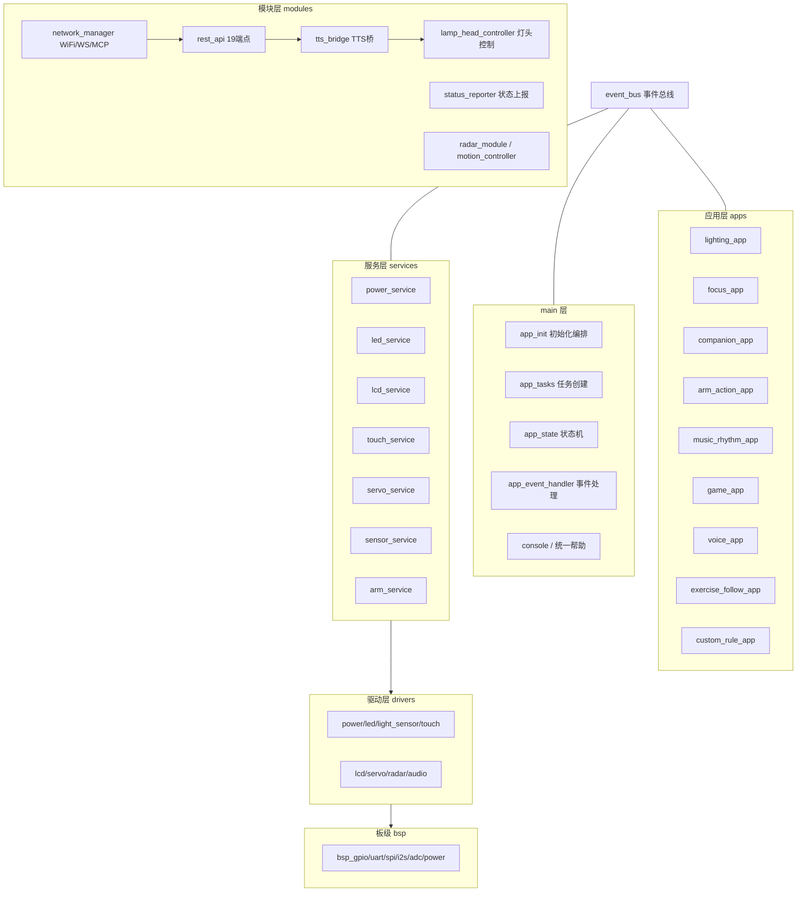

# FocusLamp_DEMO2-dowm（基座板）交接文档

> 文档日期：2026-08-25
> 用途：工程交接说明，供接手工程师快速了解"这个工程是干什么的、用什么做的、怎么跑起来"。
> 所属产品：FocusLamp 智能台灯 Demo（三块板：灯头板 / 基座板 / 语音板）

---

## 1. 工程定位：这是干什么的

本工程是 **FocusLamp 智能台灯的「基座板」固件**（工程目录名中的 `dowm` = down，即底座/下位机）。

在三板联动系统中承担的角色：

| 角色 | 具体职责 |
|------|---------|
| 底座主控 | 系统状态机管理（11 种应用状态） |
| 小屏显示 | SPI LCD 信息页（专注模式 / 陪伴模式 / 心率 / 倒计时） |
| 底部灯光 | WS2812 呼吸灯 / 灯效 |
| 机械臂控制 | 双舵机（EM3 + LX）动作库、单步动作 |
| 雷达监测 | LD6002 毫米波雷达：在位 / 心率 / 呼吸 / HRV |
| 环境光感知 | TEMT6000 光感（GPIO21/ADC1_CH5）→ 环境光自适应调光 |
| 触摸输入 | 4 路 TTP223 电容触摸（A/B/C/D） |
| 对外服务 | REST API（19 端点）、WebSocket 服务器、状态上报、TTS 桥接 |
| 模式应用 | 专注模式 focus_app、陪伴模式 companion_app、照明 lighting_app 等 9 个应用 |

**一句话总结**：基座板 = 灯的「身体」——底座灯光、小屏、机械臂、雷达心率感知都在这块板上；它通过 WiFi（REST/WebSocket）与灯头板、语音板联动，完成 7 个 Demo 演示场景。

---

## 2. 硬件平台：用什么干的

| 项目 | 规格 |
|------|------|
| 主控芯片 | **ESP32-P4**（RISC-V 双核 400MHz） |
| ESP-IDF 版本 | **5.5.4**（`sdkconfig.defaults` 注明） |
| Flash | 16MB（自定义分区表 `partitions.csv`） |
| PSRAM | 开启（`CONFIG_SPIRAM=y`，WIFI/LWIP 分配优先外置 PSRAM） |
| WiFi | **ESP-Hosted**：ESP32-P4 为主机，**ESP32-C5** 为 SDIO 协处理器（从机） |
| 音频 | I2S 相关已 **禁用**（`CONFIG_AUDIO_BRIDGE_ENABLE=n`，无音频硬件） |
| 电源 | 电源控制 MOSFET（PWR_CTRL GPIO23 / ESP_EN GPIO45） |
| 调试串口 | UART0（USB Serial JTAG，`CONFIG_ESP_CONSOLE_USB_SERIAL_JTAG=y`） |

### 2.1 外设与 GPIO 映射（详见 `docs/pin_map.md`）

| 外设 | 信号 | GPIO |
|------|------|------|
| 电源 | PWR_CTRL / ESP_EN | GPIO23 / GPIO45 |
| 底灯 | WS2812 LED_DIN（RMT） | GPIO6 |
| 光感 | TEMT6000（ADC1_CH5） | GPIO21 |
| 触摸 | TTP223 ×4（A/B/C/D） | GPIO9 / 22 / 10 / 23 |
| LCD | BL / SCL / SDA / DC / CS | GPIO51 / 50 / 36 / 49 / 34 |
| 舵机1 | EM3 UART（TX/RX/OE） | GPIO8 / 2 / 11 |
| 舵机2 | LX UART（TX/RX/OE） | GPIO3 / 20 / 4 |
| 雷达 | LD6002 UART（TX/RX） | GPIO1 / 7 |
| 双板 UART2 | TX / RX | GPIO54 / 53 |
| ESP-Hosted | SDIO 从机复位 | GPIO13 |

> 注意：GPIO46 为 ESP32-P4 保留引脚；GPIO0 需避免启动时被拉低。

---

## 3. 软件架构：怎么组织的

采用 **分层 + 事件总线** 架构（硬件驱动层 → 服务层 → 应用层）：



### 3.1 目录结构

```
FocusLamp_DEMO2-dowm/
├── CMakeLists.txt / sdkconfig / sdkconfig.defaults / partitions.csv
├── idf_component.yml           # 项目级组件依赖
├── README.md / READEME1.md / BACKLOG.md
├── docs/
│   ├── architecture.md         # 架构设计文档
│   └── pin_map.md              # GPIO 映射表
├── main/                       # 应用入口
│   ├── main.c / app_init.c / app_state.c / app_event_handler.c
│   ├── app_tasks.c             # 任务表驱动
│   ├── console_init.c / unified_help.c / app_console_commands.c
│   ├── app_mcp_handler.c       # MCP 工具分发
│   ├── app_mcp_handler.h / param_registry.c
│   ├── network/network_manager.c
│   └── tasks/                  # radar/sensor/touch/lcd/led/servo/audio/app 等任务
└── components/
    ├── apps/        # 9 个应用
    ├── bsp/         # 板级支持
    ├── common/      # 数据类型/错误码/系统配置/引脚配置
    ├── drivers/     # 硬件驱动
    ├── esp_lcd_gc9107/   # 小屏驱动
    ├── event_bus/   # 发布/订阅事件总线
    ├── modules/     # 功能模块（网络/REST/雷达/伺服/TTS 等）
    ├── protocol/    # UART 协议帧/命令解析/状态包
    └── services/    # 服务层
```

### 3.2 初始化流程（`app_init.c`）

按步骤表顺序初始化，硬件模块失败仅告警不阻断：

```
NVS Flash → Event Loop → BSP → Event Bus
→ drivers（power/led/touch/light_sensor/servo/radar）
→ services（power/led/lcd/touch/servo/sensor/arm/motion_controller）
→ network_manager（WiFi → WebSocket server → MCP → 连接管理）
→ Apps（9 个应用逐个 init）
→ app_state_manager_init → app_event_handler_init
→ 发布 EV_SYS_STARTUP_COMPLETE（进入 IDLE 态，启动 lighting_app）
```

> 关键：启动流程必须以 `EV_SYS_STARTUP_COMPLETE` 事件收尾，否则状态机卡在 INIT。

### 3.3 任务与优先级（`system_config.h`）

| 优先级 | 任务 | 说明 |
|-------|------|------|
| 6 | watchdog_task | 系统监控（最高） |
| 5 | power_task | 电源管理 |
| 4 | comm_task / servo_task | 通信与舵机（低延迟） |
| 3 | sensor / touch / audio_task | 传感器、触摸、音频 |
| 2 | led_task / lcd_task | 灯效、显示 |
| 1 | app_task | 应用调度（最低） |

---

## 4. 对外接口：怎么和其他板通信

### 4.1 通信栈

```
ESP32-C5（SDIO 从机）负责 WiFi
  → ESP-Hosted 提供网络接口
    → WebSocket 服务器（/ws + /mcp）
    → HTTP REST API（esp_http_server）
    → MCP 工具分发（app_mcp_handler）
```

### 4.2 REST API（19 个端点，`modules/rest_api`）

| 分类 | 端点 |
|------|------|
| 系统查询 | `/api/status`、`/api/system/info`、`/api/radar/status` |
| LED 控制 | `/api/led/on`、`/off`、`/brightness`、`/effect`、`/color`、`/status` |
| Display | `/api/display/on`、`/off`、`/brightness` |
| LCD | `/api/lcd/page/next`、`/expression`、`/blink/enable`、`/blink/disable` |
| Servo | `/api/servo/position`(POST/GET)、`/api/servo/home` |
| 三板联动 | `/api/arm/gesture`、`/api/detect/phone`、`/api/companion/start|stop`、`/api/chat/state`、`/api/focus/start|stop` |

### 4.3 三板联动接口（详见灯头板 `plan/09-三板联动Demo接口契约.md`）

| 方向 | 接口 | 说明 |
|------|------|------|
| 灯头板 → 基座板 | `POST /api/arm/gesture` | 机械臂单步动作（thumb_up/down） |
| 灯头板 → 基座板 | `POST /api/detect/phone` | VLM 玩手机/电脑检测转发 |
| 语音板 → 基座板 | `POST /api/companion/start|stop` | 陪伴模式开关 |
| 语音板 → 基座板 | `POST /api/chat/state` | 语音对话状态（倒计时暂停/恢复） |
| 基座板 → 语音板 | `tts_bridge_speak()` | 经 `CONFIG_TTS_BRIDGE_TARGET_IP` 调 `/api/tts/speak` 播报 |
| 基座板 → 灯头板 | `status_reporter` | 经 `CONFIG_STATUS_REPORTER_TARGET_IP` 控制灯头灯/表情 |

### 4.4 关键板间 IP 配置（menuconfig，禁止直接改 sdkconfig）

| 配置项 | 默认值 | 含义 |
|--------|--------|------|
| `CONFIG_STATUS_REPORTER_TARGET_IP` | `10.132.136.3:80` | 灯头板 IP |
| `CONFIG_TTS_BRIDGE_TARGET_IP` | `10.132.136.3:80` | 语音板 IP |
| `CONFIG_LAMP_HEAD_TARGET_IP` | `10.132.136.143:80` | 灯头控制目标 IP |
| `CONFIG_WIFI_MANAGER_SSID/PASSWORD` | RT3 / 10101010 | WiFi 账号密码 |
| `CONFIG_WIFI_MANAGER_USE_STATIC_IP` | y | 静态 IP |

---

## 5. 核心业务场景实现位置

| 场景 | 主要代码位置 |
|------|-------------|
| 专注模式（倒计时/心率/久坐提醒） | `components/apps/focus_app`、`main/tasks/radar_data_task.c`、`services/lcd_service` |
| 陪伴模式（呼吸灯/陪伴表情/机械臂手势） | `components/apps/companion_app`、`arm_service` |
| 环境光自适应调光 | `drivers/light_sensor_driver`（GPIO21）→ `services/sensor_service` → `device_state.ambient_light` → `GET /api/ambient` |
| 久坐提醒（在位≥60s） | `focus_app.c` → `tts_bridge_speak("久坐提醒")` |
| 雷达心率/呼吸/HRV | `tasks/radar_frame_handler.c`、`tasks/radar_decoder.c`、`tasks/hrv_analyzer.c` |
| 机械臂动作库 | `modules/motion_controller`、`services/arm_service` |
| 状态上报 | `modules/status_reporter`（定时 10s + 事件触发） |

---

## 6. 构建与烧录（由用户本地执行）

```bash
cd E:\focus\Focus_demo2\FocusLamp_DEMO2-dowm
idf.py set-target esp32p4
idf.py menuconfig   # 按需修改 WiFi/目标 IP 等配置
idf.py build
idf.py flash monitor
```

> 前置：ESP-IDF 5.5.4 环境（如 `C:\Software\Espressif\.espressif\v6.0.1\esp-idf`），ESP-Hosted 组件已配置 SDIO 连接 ESP32-C5 从机。

---

## 7. 当前状态与待办（BACKLOG.md 摘要）

| 优先级 | 事项 | 状态 |
|-------|------|------|
| 高 | status_reporter 目标 IP 修复（已改为实际 IP） | ✅ 已完成 |
| 高 | 状态上报端到端测试（定时/事件触发/JSON 格式） | 待测试 |
| 高 | 19 个 REST API 端点验证 | 部分完成 |
| 中 | 阶段 D：MCP 工具包装为 REST 端点 | 未开始 |
| 中 | 阶段 E：音频控制命令接口 | 未开始 |
| 低 | WiFi 信号优化（RSSI -87dBm） | 观察中 |
| 低 | SDIO 传输稳定性监控（丢包警告） | 观察中 |

---

## 8. 交接注意事项

1. **音频已禁用**：本板无音频硬件，`audio_bridge`、`xiaozhi_manager` 均关闭；音频/语音能力在语音板。
2. **WiFi 依赖 ESP-Hosted**：WiFi 不在 P4 上，而由 SDIO 外挂的 ESP32-C5 提供；启动时注意 SDIO 连接与从机固件版本一致性（Host FW 2.12.11）。
3. **光感已恢复**：`pin_map.md` 曾标注光感移除，但代码中 `light_sensor_driver`（GPIO21/ADC1_CH5）已恢复，用于环境光自适应调光；亮度映射参数可能需实测调参。
4. **不直接修改 sdkconfig / partitions / managed_components**：配置一律通过 `idf.py menuconfig` 修改。
5. **提交规范**：代码烧录验证通过后再 `git add/commit`；C/H 文件需过 clang-format。
6. 调试入口：上电后 UART 控制台输入 `help` 查看命令；状态机由事件总线驱动，排查交互问题先看事件日志。
